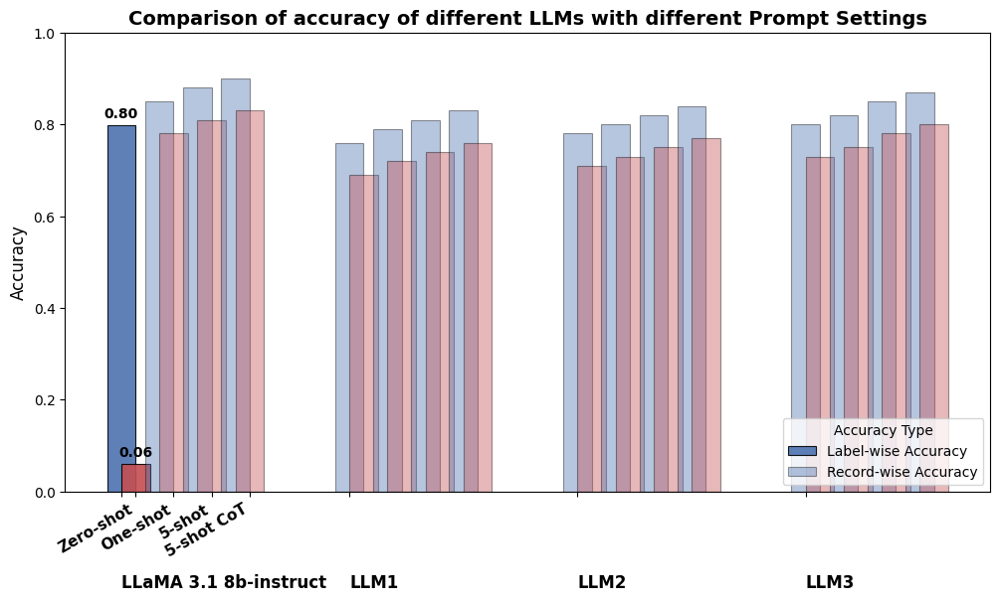

# Welcome to Medical Leaderboard 
Objective: To establish a benchmark data and evaluate LLMs for various Medical NLP tasks. 

# First Task
Ground truthing of chest x-ray radiological reports. The current leaderboard (WIP) looks like:


## Goal of this leaderboard
1. To create prompts that gives out the best accuracy for binary classification of ground truth


## Dataset
For this leaderboard, we are using radiological reports dataset of chexpert plus https://stanfordaimi.azurewebsites.net/datasets/5158c524-d3ab-4e02-96e9-6ee9efc110a1

About the Data:
1. Using subset of the above data, the data above contains 187,711 reports, we would be using 10k subset from the above
2. You can access the data on the above link, and file will be using "impression_fixed.json", each report is classified into 14 pathological classes namely:
    1. Enlarged Cardiomediastinum, Cardiomegaly, Lung Opacity, Lung Lesion, Edema, Consolidation, Pneumonia, Atelectasis, Pneumothorax, Pleural Effusion, Pleural Other, Fracture, Support Devices, No Finding.
    2. Each class has multiple labels of 1 (positive), -1 (uncertain), 0 (negative), null (not mentioned) 
3. Subset 10k (exact 10658), so, from the above dataset, goal is to find a subset with equal representation of classes. The graph for this subset is below
    1. the null class is replaced with 2, just to each out data handelling


## Prompt engineering
1. We will be using different techniques of prompt to reach to the ground truth
2. Different prompts we would try would be:
    1. zero-shot prompt: 
    2. one-shot prompt:
    2. five shot prompts: 
    3. five shot prompts with chain of thought:

### Different prompts
So, here is the trial zero-shot prompt that was tried (it was generated by chatgpt, but you can obviously do it better):
```
{
    "impression": [{
    "role": "system", "content": "You are a radiologist whose goal is to read radiological reports and give user wanted outputs"}, {
    "role": "user", "content": """You are an expert radiologist analyzing chest X-ray reports. Your task is to extract specific findings from the provided radiology report and output them in a structured dictionary format. Each finding can have one of the following values: 1 (Positive): The finding is explicitly mentioned as present. -1 (Uncertain): The report suggests uncertainty or possible presence of the finding. 0 (Negative): The finding is explicitly mentioned as absent. 2 (Not Mentioned)**: The report does not mention the finding at all. Expected Output Format:
    Return your response in a valid dictionary format without explanations. Use the following structure: {
    "Enlarged Cardiomediastinum": value,
    "Cardiomegaly": value,
    "Lung Opacity": value,
    "Lung Lesion": value,
    "Edema": value,
    "Consolidation": value,
    "Pneumonia": value,
    "Atelectasis": value,
    "Pneumothorax": value,
    "Pleural Effusion": value,
    "Pleural Other": value,
    "Fracture": value,
    "Support Devices": value,
    "No Finding": value }. Here is the radilogical report that you need to read.""" + i + """
    Please make sure return only dictionary , do not return any other text or explanation"""},
    ], 
    "token" : 300}
```

## Submit your prompts
This is the google form, where you can submit your prompts, - [link](https://forms.gle/iYDssaV7oWAvEo3j7)
What you need to submit
1. A model preferrably hugging face link - that can run on 24 GB vRAM of GPU
2. A prompt - any of the given shots. If you need access to reports, here is the link [Link to Chexpert](https://stanfordaimi.azurewebsites.net/datasets/5158c524-d3ab-4e02-96e9-6ee9efc110a1)


## Different model
Use any open model available of any parameter and activation, results will be displayed here

## Metrices that would be captured
1. Accuracy:
    1. Label-wise accuracy: It captures, how many labels are correct
    2. Record-wise accuracy: It captures, how many reports are correctly classified. It means that even if one label in the report is wrongly classified, then that record becomes inaccurate


## Leaderboard graph (WIP)

The visible are done with experiments


## To do
- [ ] try different llama models


## Restrictions
1. For now being only evaluating model, that can be run locally and on 24 GB vRAM 
