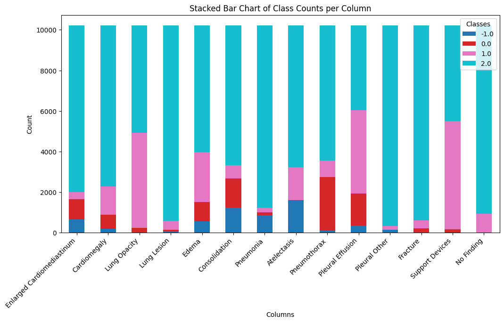

# Welcome to Medical Leaderboard 
About: The main objective is to establish a benchmark to use which tools to get best out of your work. We will evaluate here performance of various LLM models on various Medical NLP tasks. 

# First Task
Ground truthing of chest x-ray radiological reports. 

## Goal of this leaderboard
1. To create prompts that gives out the best accuracy for binary classification of ground truth

## Dataset
For this leaderboard, we are using radiological reports dataset of chexpert plus https://stanfordaimi.azurewebsites.net/datasets/5158c524-d3ab-4e02-96e9-6ee9efc110a1

About the Data:
1. Using subset of the above data, the data above contains 187,711 reports, we would be using 10k subset from the above
2. You can access the data on the above link, and file will be using "report_fixed.json", each report is classified into 14 pathological classes namely:
    1. Enlarged Cardiomediastinum, Cardiomegaly, Lung Opacity, Lung Lesion, Edema, Consolidation, Pneumonia, Atelectasis, Pneumothorax, Pleural Effusion, Pleural Other, Fracture, Support Devices, No Finding.
    2. Each class has multiple labels of 1 (positive), -1 (uncertain), 0 (negative), null (not mentioned) 
3. Subset 10k (exact 10658), so, from the above dataset, goal is to find a subset with equal representation of classes. The graph for this subset is below
    1. the null class is replaced with 2, just to each out data handelling

## Prompt engineering
1. We will be using different techniques of prompt to reach to the ground truth
2. Different prompts we would try would be:
    1. zero-shot prompts: 
    2. five shot prompts: 
    3. five shot prompts with chain of thought:

## Different model
Use any open model available of any parameter, results will be displayed here

## Metrices that would be captured
Recall, Specificty, Precision, NPV, Accuracy, F1-Score.

## Leaderboard graph

## To do
- [ ] try different llama models

